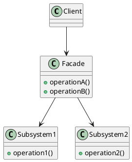
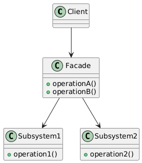

# Clase 12 - Facade Pattern

## Objetivos

- Entender el patrón de diseño **Facade**.
- Implementar el patrón **Facade** en un caso práctico.
- Aprender a simplificar la interacción con sistemas complejos usando una fachada.

---

## 1. ¿Qué es el patrón Facade?

El patrón **Facade** es un patrón de diseño estructural que proporciona una interfaz simplificada para un sistema complejo de clases, bibliotecas o frameworks. Este patrón no añade funcionalidad nueva, sino que agrupa operaciones complejas detrás de una única interfaz que hace que el sistema sea más fácil de usar.

### Características clave

- **Simplificación**: Proporciona una interfaz fácil de usar para sistemas complicados.
- **Ocultación de detalles**: Elimina la necesidad de que los clientes conozcan el funcionamiento interno del sistema.
- **Reducción de dependencias**: Los clientes interactúan con menos clases directamente, lo que reduce el acoplamiento.

---

## 2. Estructura del patrón

En el patrón **Facade**, los componentes principales son:

- **Facade**: La clase que proporciona una interfaz simplificada.
- **Subsistemas**: Las clases que realizan las operaciones reales. Estas pueden ser complejas y tener múltiples interacciones entre sí, pero el cliente no necesita saberlo.

---

## 3. Diagrama UML





## 4. Ejemplo práctico

### Contexto

Imagina que estás desarrollando un sistema de cine en el que los usuarios pueden reservar entradas. Este sistema involucra varias operaciones como verificar la disponibilidad de los asientos, procesar el pago y enviar el ticket al usuario. El patrón Facade puede simplificar la interacción del cliente con estas operaciones.

### Código de ejemplo

```go
package main

import "fmt"

// Subsistemas
type SeatBooking struct{}

func (s *SeatBooking) CheckAvailability() bool {
    fmt.Println("Verificando disponibilidad de asientos...")
    return true
}

type PaymentProcessor struct{}

func (p *PaymentProcessor) ProcessPayment() {
    fmt.Println("Procesando el pago...")
}

type TicketIssuer struct{}

func (t *TicketIssuer) SendTicket() {
    fmt.Println("Enviando ticket al cliente...")
}

// Facade
type CinemaFacade struct {
    seatBooking     *SeatBooking
    paymentProcessor *PaymentProcessor
    ticketIssuer    *TicketIssuer
}

func NewCinemaFacade() *CinemaFacade {
    return &CinemaFacade{
        seatBooking:     &SeatBooking{},
        paymentProcessor: &PaymentProcessor{},
        ticketIssuer:    &TicketIssuer{},
    }
}

func (c *CinemaFacade) BookTicket() {
    if c.seatBooking.CheckAvailability() {
        c.paymentProcessor.ProcessPayment()
        c.ticketIssuer.SendTicket()
    }
}

func main() {
    facade := NewCinemaFacade()
    facade.BookTicket()
}
```

### Explicación del código

- Subsistemas: SeatBooking, PaymentProcessor y TicketIssuer son los subsistemas que manejan tareas específicas.
- Facade: CinemaFacade oculta la complejidad de los subsistemas y ofrece un método simplificado BookTicket para que el cliente interactúe con el sistema.

## 5. Ejercicio práctico

### Instrucciones

Implementa un sistema de Home Theater utilizando el patrón Facade. El sistema debe incluir los siguientes subsistemas:

- Sistema de Sonido: Para manejar la configuración de audio.
- Proyector: Para manejar la proyección de la película.
- Reproductor de Blu-ray: Para reproducir la película.

Crea una fachada que simplifique el uso de estos subsistemas con una única operación WatchMovie().

## 6. Beneficios del patrón Facade

- Reducción de complejidad: Los clientes interactúan con una interfaz simple.
- Desacoplamiento: El cliente no necesita conocer la estructura interna de los subsistemas.
- Flexibilidad: Puedes agregar nuevas funcionalidades sin afectar al cliente.

## Recursos adicionales

- [Facade Pattern en Refactoring Guru](https://refactoring.guru/design-patterns/facade)
- [Documentación del patrón Facade en Sourcemaking](https://sourcemaking.com/design_patterns/facade)
- [Design Patterns Explained Simply: Facade Pattern](https://www.baeldung.com/cs/facade-design-pattern)
- [Facade Design Pattern - GeeksforGeeks](https://www.geeksforgeeks.org/facade-design-pattern-introduction/)
