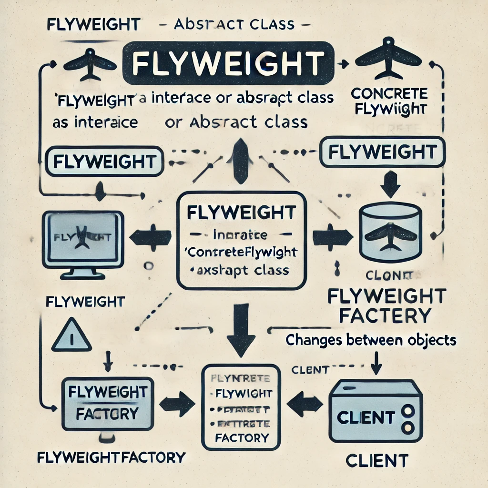

# Clase 13: Flyweight Pattern

## Objetivo

El objetivo de esta clase es comprender el patrón estructural **Flyweight**, que permite reducir el consumo de memoria mediante la reutilización de objetos comunes en diferentes partes de la aplicación. Aprenderemos cómo identificar cuándo aplicarlo, cómo implementarlo en código y sus ventajas.

## 1. Introducción al Patrón Flyweight

### ¿Qué es el Patrón Flyweight?

El patrón **Flyweight** es un patrón de diseño estructural que se utiliza para minimizar el uso de memoria mediante la reutilización de objetos que son similares. Esto es útil en situaciones donde un gran número de objetos se crean constantemente, pero muchos de ellos comparten los mismos datos.

### Ejemplo del mundo real

Imagina un juego en el que se dibujan miles de árboles. Cada árbol tiene propiedades como tipo de árbol, textura, posición, etc. Sin el patrón Flyweight, tendrías que almacenar la misma información (como la textura del árbol) muchas veces, lo que ocuparía una gran cantidad de memoria. El patrón Flyweight te permite compartir esta información repetida, almacenándola una sola vez y reutilizándola.

### Uso común

- Aplicaciones con muchos objetos similares.
- Aplicaciones que necesitan optimizar el consumo de memoria.
- Juegos, gráficos, procesamiento de texto, etc.

## 2. Diagrama UML del Patrón Flyweight



### Componentes

- **Flyweight (Interfaz/Abstracto):** Define la interfaz para los objetos que se pueden compartir.
- **ConcreteFlyweight:** Implementa la interfaz Flyweight y añade el estado intrínseco que se puede compartir.
- **FlyweightFactory:** Gestiona la creación y el almacenamiento de objetos Flyweight.
- **Cliente:** El código que usa objetos Flyweight.

### Estado Intrínseco vs Extrínseco

- **Intrínseco:** Estado que se puede compartir y que no cambia (por ejemplo, el tipo de árbol).
- **Extrínseco:** Estado que varía entre objetos y no se puede compartir (por ejemplo, la posición de un árbol).

## 3. Implementación del Patrón Flyweight

### Código base en Go

```go
package main

import "fmt"

// Flyweight Interface
type TreeType interface {
    Display(x, y int)
}

// ConcreteFlyweight
type ConcreteTreeType struct {
    name     string
    color    string
    texture  string
}

func (t *ConcreteTreeType) Display(x, y int) {
    fmt.Printf("Árbol %s en color %s mostrado en la posición (%d, %d)\n", t.name, t.color, x, y)
}

// Flyweight Factory
type TreeFactory struct {
    treeTypes map[string]*ConcreteTreeType
}

func NewTreeFactory() *TreeFactory {
    return &TreeFactory{treeTypes: make(map[string]*ConcreteTreeType)}
}

func (f *TreeFactory) GetTreeType(name, color, texture string) *ConcreteTreeType {
    key := name + "-" + color + "-" + texture
    if f.treeTypes[key] == nil {
        f.treeTypes[key] = &ConcreteTreeType{name: name, color: color, texture: texture}
    }
    return f.treeTypes[key]
}

// Cliente
type Tree struct {
    x, y      int
    treeType  TreeType
}

func NewTree(x, y int, treeType TreeType) *Tree {
    return &Tree{x: x, y: y, treeType: treeType}
}

func (t *Tree) Display() {
    t.treeType.Display(t.x, t.y)
}

func main() {
    factory := NewTreeFactory()

    // Crear árboles reutilizando Flyweights
    tree1 := NewTree(10, 20, factory.GetTreeType("Pino", "Verde", "Textura1"))
    tree2 := NewTree(30, 40, factory.GetTreeType("Pino", "Verde", "Textura1"))
    tree3 := NewTree(50, 60, factory.GetTreeType("Roble", "Marrón", "Textura2"))

    // Mostrar árboles
    tree1.Display()
    tree2.Display()
    tree3.Display()
}
```

#### Explicación

1. Flyweight Interface: Define la operación Display que todos los objetos Flyweight deben implementar.
2. ConcreteFlyweight: Implementa la interfaz y contiene el estado intrínseco (nombre, color, textura).
3. FlyweightFactory: Gestiona la creación y el almacenamiento de objetos ConcreteTreeType, asegurándose de reutilizar objetos cuando sea necesario.
4. Cliente: Utiliza los Flyweights pero maneja el estado extrínseco (posición de los árboles).

## 4. Ejercicio práctico

### Descripción

Crea un programa en Go utilizando el patrón Flyweight para representar vehículos (coches). Cada vehículo debe tener un tipo, color, y marca (estado intrínseco) y una posición en una carretera (estado extrínseco). Implementa un Factory que gestione la creación de los vehículos y los reutilice cuando sea posible.

### Puntos clave

- Usa el patrón Flyweight para reducir el uso de memoria.
- Implementa un Factory que gestione la reutilización de objetos.
- El cliente debe poder asignar posiciones a cada vehículo de manera dinámica.

## 5. Conclusión

El patrón Flyweight es muy útil en situaciones donde tenemos muchos objetos similares y necesitamos optimizar el uso de memoria. Al aplicar este patrón, podemos mejorar el rendimiento de aplicaciones con recursos limitados.

## Recursos adicionales

Si quieres aprender más sobre el patrón Flyweight y otros patrones de diseño, aquí tienes algunos recursos adicionales que pueden ser útiles:

- [Refactoring Guru](https://refactoring.guru/design-patterns/flyweight): Excelente referencia para aprender sobre patrones de diseño con ejemplos en distintos lenguajes de programación.
  
- **Design Patterns: Elements of Reusable Object-Oriented Software**: Este es el libro clásico sobre patrones de diseño, escrito por Erich Gamma, Richard Helm, Ralph Johnson y John Vlissides (también conocidos como la "Banda de los Cuatro").

- **Head First Design Patterns** de Eric Freeman & Elisabeth Robson: Un libro excelente para una introducción más visual y práctica a los patrones de diseño.

- [Golang Design Patterns](https://golangbyexample.com/all-design-patterns-golang/): Un sitio web con ejemplos implementados específicamente en Go, un gran recurso para revisar patrones en este lenguaje.
