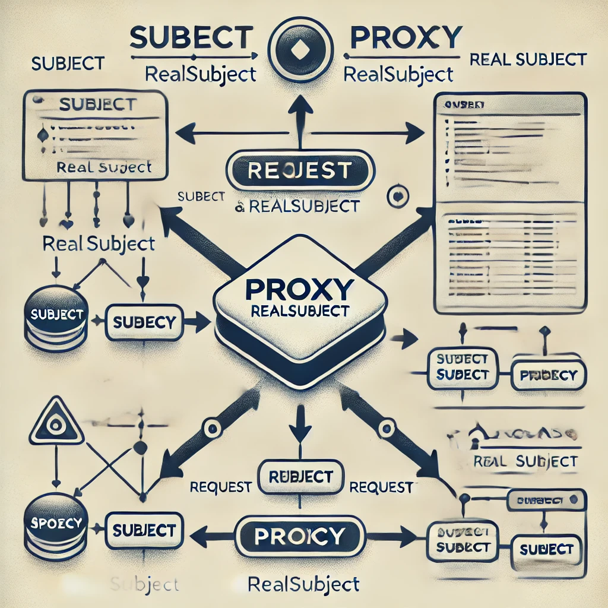

# Clase 14: Proxy Pattern

## Objetivos

1. **Comprender el concepto del patrón Proxy.**
2. **Diferenciar entre los diferentes tipos de Proxy.**
3. **Implementar el patrón Proxy para controlar el acceso a un objeto.**

## 1. Introducción al Proxy Pattern

El **Proxy Pattern** (Patrón de Proxy) proporciona un objeto sustituto o "representante" que controla el acceso a otro objeto. Este patrón es útil cuando se desea agregar una capa adicional de control sobre el objeto que se está utilizando, sin modificar su implementación.

## 2. Estructura del Proxy Pattern

- **Subject**: Interfaz común para los objetos reales y los proxies. Define las operaciones que se realizarán.
  
- **RealSubject**: El objeto real al que se accede.
  
- **Proxy**: El objeto que controla el acceso al RealSubject, delegando las llamadas o añadiendo lógica extra.



## 3. Tipos de Proxy

1. **Proxy remoto**: Controla el acceso a un objeto que está en una ubicación diferente (por ejemplo, una máquina remota).
2. **Proxy virtual**: Retrasa la creación o inicialización de un objeto pesado hasta que realmente se necesite.
3. **Proxy de protección**: Controla el acceso a los métodos del objeto dependiendo de los permisos del cliente.
4. **Proxy de caché**: Proporciona almacenamiento temporal de los resultados de una operación costosa en términos de tiempo.

## 4. Implementación del Proxy Pattern

Vamos a implementar un proxy de protección que controla el acceso a un servicio bancario real.

### Paso 1: Definir la interfaz `Subject` (Banco)

```go
type Bank interface {
    WithdrawMoney(accountID string, amount int) string
}
```

### Paso 2: Crear el objeto real `RealBank`

```go
type RealBank struct{}

func (b *RealBank) WithdrawMoney(accountID string, amount int) string {
    return fmt.Sprintf("Se han retirado $%d de la cuenta %s", amount, accountID)
}
```

### Paso 3: Implementar el proxy `BankProxy`

```go
type BankProxy struct {
    realBank *RealBank
    allowedAccounts map[string]bool
}

func NewBankProxy() *BankProxy {
    return &BankProxy{
        realBank: &RealBank{},
        allowedAccounts: map[string]bool{
            "12345": true,
            "67890": true,
        },
    }
}

func (p *BankProxy) WithdrawMoney(accountID string, amount int) string {
    if !p.allowedAccounts[accountID] {
        return fmt.Sprintf("Acceso denegado para la cuenta %s", accountID)
    }
    return p.realBank.WithdrawMoney(accountID, amount)
}
```

### Paso 4: Uso del Proxy

```go
func main() {
    bankProxy := NewBankProxy()

    fmt.Println(bankProxy.WithdrawMoney("12345", 100))
    fmt.Println(bankProxy.WithdrawMoney("99999", 200))
}
```

## 5. Ventajas del Proxy Pattern

- **Control de acceso:** El proxy puede restringir o filtrar el acceso al objeto real.
- **Optimización:** Permite la inicialización diferida (lazy loading) o la mejora del rendimiento mediante la implementación de caché.
- **Seguridad:** Los proxies pueden proteger objetos restringiendo el acceso basado en condiciones externas

## 6. Ejercicio práctico

Implemente un proxy virtual que retrase la creación de un objeto pesado (por ejemplo, cargar un archivo grande) hasta que sea absolutamente necesario.

## Recursos adicionales

### Lecturas recomendadas

- **"Design Patterns: Elements of Reusable Object-Oriented Software"** por Erich Gamma, Richard Helm, Ralph Johnson, y John Vlissides (Gang of Four): Este es el libro que introdujo el concepto de los patrones de diseño en el desarrollo de software. Es una referencia esencial para cualquier desarrollador de software.
  
- **"Head First Design Patterns"** por Eric Freeman y Elisabeth Robson: Este libro adopta un enfoque más visual y conversacional para enseñar los patrones de diseño. Es excelente para quienes buscan una introducción más amigable y accesible.

- **"Refactoring to Patterns"** por Joshua Kerievsky: Este libro es una excelente referencia sobre cómo aplicar patrones de diseño en el contexto del código existente a través de técnicas de refactorización.

### Enlaces de interés

- [Refactoring.Guru - Proxy Pattern](https://refactoring.guru/design-patterns/proxy): Un sitio web con explicaciones detalladas y ejemplos de todos los patrones de diseño, incluido el Proxy Pattern.
  
- [SourceMaking - Proxy Pattern](https://sourcemaking.com/design_patterns/proxy): Otro recurso en línea que ofrece descripciones y ejemplos de los patrones de diseño, incluyendo Proxy.
  
- [DZone - Design Patterns](https://dzone.com/design-patterns-tutorials-tools-news): Un blog que publica tutoriales y noticias sobre patrones de diseño.

- [Stack Overflow - Preguntas sobre patrones de diseño](https://stackoverflow.com/questions/tagged/design-patterns): Una gran comunidad de desarrolladores donde puedes buscar respuestas a tus preguntas sobre patrones de diseño.

### Videos

- **[Proxy Design Pattern - Derek Banas](https://www.youtube.com/watch?v=NwaabHqPHeM)**: Un video de YouTube que explica el Proxy Pattern con un ejemplo práctico en Java.

- **[Design Patterns en 5 minutos - Proxy Pattern](https://www.youtube.com/watch?v=F9RXAsOM4PU)**: Video en español que explica el patrón de diseño Proxy en un formato corto y conciso.
