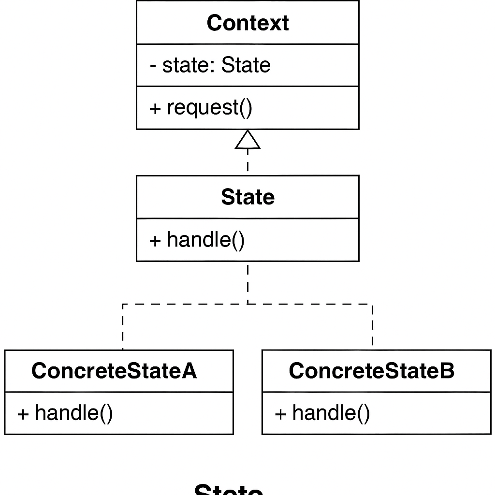

# Clase 21: State Pattern

## Objetivos de Aprendizaje

- Comprender el propósito del patrón State y cuándo aplicarlo.
- Implementar el patrón State para manejar el comportamiento de un objeto basado en su estado interno.
- Identificar la diferencia entre usar condicionales versus encapsular comportamientos en clases de estado.

---

## ¿Qué es el patrón State?

El patrón **State** permite que un objeto altere su comportamiento cuando su estado interno cambia. El objeto parecerá cambiar su clase.

Este patrón es útil cuando un objeto debe cambiar su comportamiento en función de su estado actual, y quieres evitar una gran cantidad de condicionales.

---

## Diagrama UML

Incluye una imagen con la estructura del patrón:

- `Context`: mantiene una referencia al estado actual.
- `State`: interfaz común para todos los estados concretos.
- `ConcreteStateA`, `ConcreteStateB`, etc.: implementaciones específicas del comportamiento para un estado particular.

---

## Ejemplo conceptual en Go

1. Define una interfaz `State` con el comportamiento común.
2. Implementa varios estados concretos que cumplen esa interfaz.
3. Define un `Context` que mantiene una referencia al estado actual y delega el comportamiento a este.

---

## Ejercicio práctico

### Enunciado:

Simula una **máquina expendedora** que cambia su comportamiento según su estado:

- Estados:
  - Sin moneda
  - Con moneda
  - Producto dispensado
  - Sin inventario

### Requisitos:

- Debes tener una interfaz `State` con métodos como `InsertCoin()`, `EjectCoin()`, `SelectProduct()`, `Dispense()`.
- Implementa al menos 3 estados concretos.
- El contexto (`VendingMachine`) mantiene el estado actual y lo cambia según las acciones del usuario.

---

## Recursos adicionales

- [Refactoring Guru - State Pattern](https://refactoring.guru/design-patterns/state)
- [Dive Into Design Patterns - State](https://refactoring.guru/design-patterns/state/go/example)

---

## Desafío (Opcional)

Crea una versión del patrón State para modelar el **estado de una orden de compra** (`Pendiente`, `Pagada`, `Enviada`, `Entregada`, `Cancelada`). Asegúrate de que las transiciones ilegales de estado no sean posibles.

---

## ¿Qué sigue?

En la siguiente clase veremos el **Strategy Pattern**, otro patrón de comportamiento que te ayudará a encapsular algoritmos y cambiar su lógica en tiempo de ejecución.

