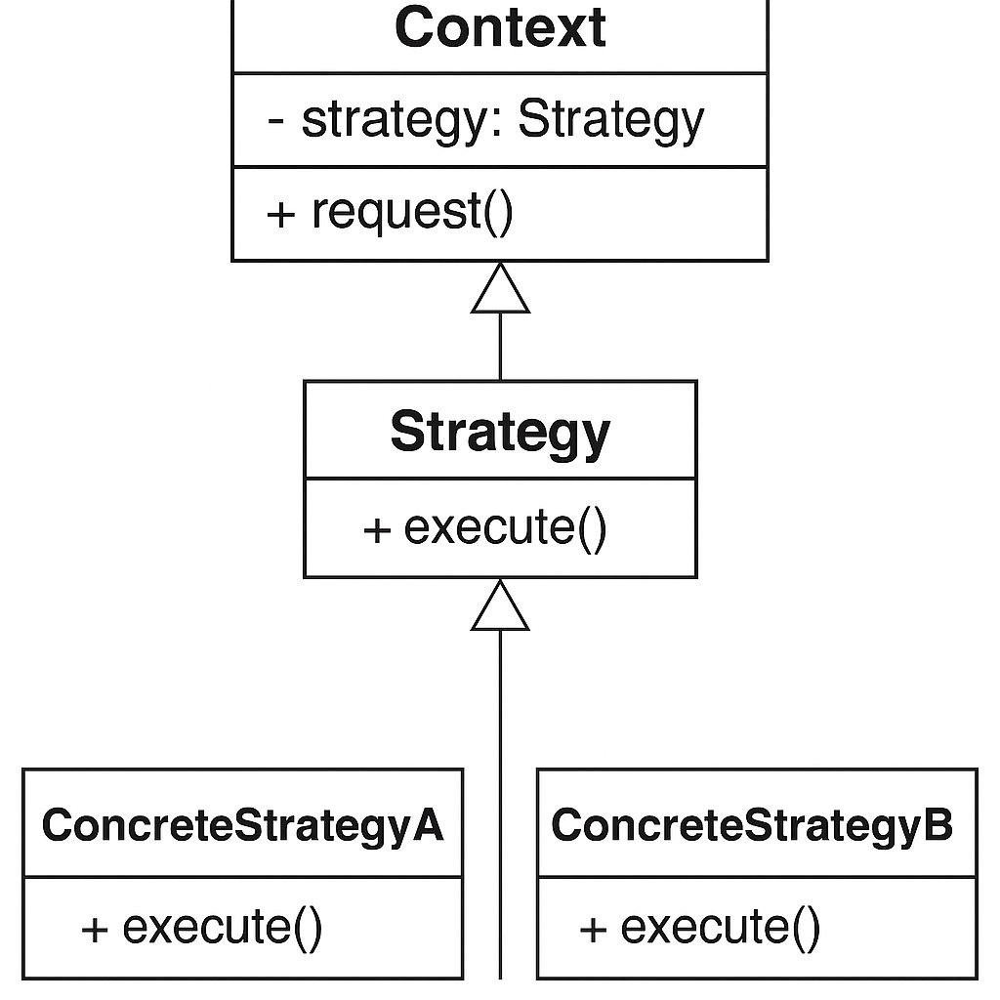

# Clase 22: Strategy Pattern

## Objetivos de Aprendizaje

- Entender qué es el patrón Strategy y en qué situaciones usarlo.
- Implementar el patrón Strategy para permitir cambiar algoritmos de forma flexible en tiempo de ejecución.
- Mejorar el diseño eliminando condicionales extensivos mediante estrategias intercambiables.

---

## ¿Qué es el patrón Strategy?

El patrón **Strategy** define una familia de algoritmos, los encapsula y los hace intercambiables. El patrón permite que el algoritmo varíe independientemente de los clientes que lo utilizan.

Se usa cuando tienes múltiples formas de realizar una acción, y quieres elegir la mejor opción en tiempo de ejecución.

---

## Diagrama UML

Incluye una imagen con la estructura del patrón:

- `Context`: mantiene una referencia a un objeto `Strategy`.
- `Strategy`: interfaz común para todos los algoritmos.
- `ConcreteStrategyA`, `ConcreteStrategyB`, etc.: implementaciones específicas del algoritmo.

---

## Ejemplo conceptual en Go

1. Define una interfaz `Strategy` con un método como `Execute()`.
2. Implementa varias estrategias concretas que cumplen esa interfaz.
3. El `Context` utiliza una `Strategy` que puede ser cambiada dinámicamente.

---

## Ejercicio práctico

### Enunciado

Implementa un sistema de **compresión de archivos** usando el patrón **Strategy**.

Crea una interfaz `CompressionStrategy` con un método `Compress(fileName string)`.

Luego implementa **dos estrategias concretas**:

- `ZipCompression`: simula comprimir archivos en formato `.zip`.
- `RarCompression`: simula comprimir archivos en formato `.rar`.

Crea una estructura `Compressor` (Contexto) que permita **cambiar dinámicamente** la estrategia de compresión y comprimir un archivo.

### Requisitos

- El método `Compress(fileName string)` debe imprimir algo como:
  - `"Archivo report.doc comprimido usando ZIP"`
  - `"Archivo report.doc comprimido usando RAR"`
- El usuario debe poder cambiar de estrategia en tiempo de ejecución.
- Simula comprimir **al menos dos archivos diferentes** usando **estrategias distintas**.

### Sugerencias

- Al cambiar de estrategia, vuelve a llamar al método de compresión para comprobar que el comportamiento varía.
- No necesitas hacer compresión real, solo simula la acción usando `fmt.Println`.

---

## Recursos adicionales

- [Refactoring Guru - Strategy Pattern](https://refactoring.guru/design-patterns/strategy)
- [Dive Into Design Patterns - Strategy](https://refactoring.guru/design-patterns/strategy/go/example)

---

## Desafío (Opcional)

Extiende el proyecto para permitir que el usuario **cambie** de método de pago en mitad del proceso de compra (antes de pagar) y que vea las tarifas o comisiones que cada estrategia podría cobrar.

---

## ¿Qué sigue?

En la próxima clase veremos el **Template Method Pattern**, otro patrón de comportamiento que ayuda a definir el esqueleto de un algoritmo dejando algunos pasos a ser implementados por las subclases.