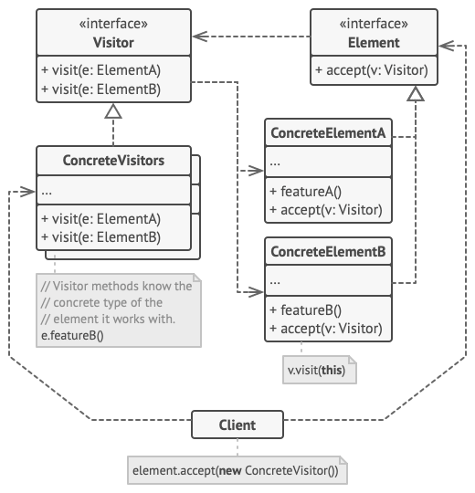

# Clase 25: Visitor Pattern

## 🧠 Objetivos

- Comprender qué es el patrón Visitor y cuál es su propósito.
- Aplicar el patrón para separar algoritmos de estructuras de datos.
- Implementar el patrón en Go para aumentar la extensibilidad del código sin modificar estructuras existentes.
- Practicar la aplicación del patrón a través de un ejercicio práctico.

---

## 📌 ¿Qué es el Patrón Visitor?

El **patrón Visitor** es un patrón de comportamiento que te permite agregar operaciones a estructuras de objetos sin modificar las clases en sí. Define una nueva operación sin cambiar las clases de los elementos sobre los que opera.

Se utiliza cuando necesitas realizar operaciones sobre una colección de objetos con distintas clases, pero sin modificar esas clases cada vez que necesites una nueva operación.

---

## 📊 Diagrama UML



- `Visitor`: interfaz que declara operaciones de visita para cada tipo concreto de elemento.
- `ConcreteVisitor`: implementa comportamientos específicos.
- `Element`: interfaz o clase abstracta que acepta visitantes.
- `ConcreteElement`: implementa la lógica para aceptar un visitante.

Fuente: [Refactoring Guru](https://refactoring.guru/design-patterns/visitor)

---

## 🧪 Ejemplo Conceptual

Supón que tienes una jerarquía de objetos como `Libro`, `Revista`, `Diario`, y necesitas aplicar distintas operaciones (como calcular impuesto o mostrar contenido) sin modificar las clases.

En lugar de agregar estos métodos a cada clase, puedes crear visitantes como `ImpuestoVisitor`, `ContenidoVisitor`, y pasarlos a cada objeto.

---

## 💻 Ejemplo en Go

```go
package main

import "fmt"

// Element interface
type Element interface {
	Accept(Visitor)
}

// Visitor interface
type Visitor interface {
	VisitBook(*Book)
	VisitMagazine(*Magazine)
}

// Concrete Elements
type Book struct {
	Title string
}

func (b *Book) Accept(v Visitor) {
	v.VisitBook(b)
}

type Magazine struct {
	Title string
}

func (m *Magazine) Accept(v Visitor) {
	v.VisitMagazine(m)
}

// Concrete Visitor
type PrintVisitor struct{}

func (v *PrintVisitor) VisitBook(b *Book) {
	fmt.Println("Libro:", b.Title)
}

func (v *PrintVisitor) VisitMagazine(m *Magazine) {
	fmt.Println("Revista:", m.Title)
}

func main() {
	elements := []Element{
		&Book{Title: "El principito"},
		&Magazine{Title: "National Geographic"},
	}

	visitor := &PrintVisitor{}
	for _, el := range elements {
		el.Accept(visitor)
	}
}
```

## 🛠️ Ejercicio Práctico

**Ejercicio:**
Modela una aplicación que maneja distintos documentos: `Factura`, `Informe`, `Recibo`. Cada documento debe aceptar visitantes que realicen diferentes operaciones, como:

* Imprimir contenido
* Calcular total
* Exportar a PDF

**Instrucciones:**

* Crea interfaces `Document` y `Visitor`.
* Implementa tres clases concretas de documento.
* Implementa al menos dos visitantes.
* Usa el patrón para aplicar múltiples operaciones sobre los documentos.

## 📚 Recursos adicionales

* [Refactoring Guru - Visitor](https://refactoring.guru/design-patterns/visitor)
* [Go Patterns - Visitor](https://golangbyexample.com/)
* Video en español: [Patrón Visitor explicado](https://www.youtube.com/watch?v=LEpaVw1zBMw)

## 🚀 Desafío (opcional)

Crea una jerarquía de nodos para una estructura de árbol de archivos (por ejemplo, carpetas y archivos) y utiliza el patrón Visitor para implementar:

* Un contador de archivos por tipo.
* Un verificador de permisos.
* Un generador de árbol de rutas en formato texto.

Apunta a un diseño extensible y desacoplado.