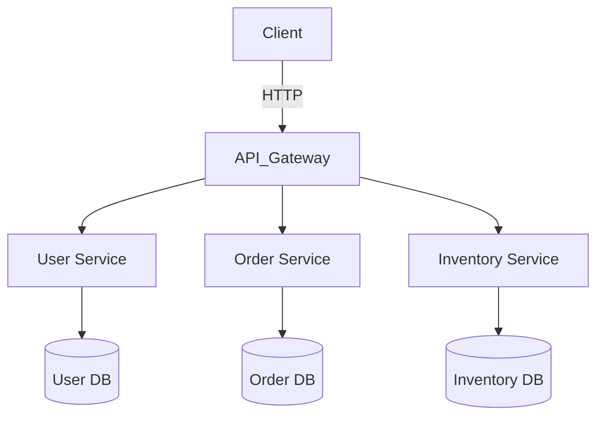

# Class 36: Microservices Architecture

## Objectives
- Understand the concept of microservices and how they differ from monolithic architectures.
- Learn how to design and implement microservices in Go.
- Explore inter-service communication patterns, scalability, and deployment considerations.

## What is Microservices Architecture
Microservices Architecture is an architectural style that structures an application as a collection of small, independent, and loosely coupled services.  
Each service focuses on a single business capability and communicates with others through well-defined APIs (usually HTTP or message queues).

### Key characteristics:
- **Independence:** Each microservice can be developed, deployed, and scaled independently.
- **Decentralization:** Each service has its own database or data store.
- **Resilience:** Failures in one service should not crash the entire system.
- **Technology diversity:** Different services can use different programming languages or technologies.

## UML Diagram


## Conceptual Example
Imagine an e-commerce platform divided into independent services:
- **User Service:** Manages users and authentication.
- **Product Service:** Manages product catalog.
- **Order Service:** Manages customer orders.

Each service runs independently, can be deployed on different servers, and communicates through REST APIs.

## Go Example
```go
// user_service.go
package main

import (
    "encoding/json"
    "net/http"
)

type User struct {
    ID   int    `json:"id"`
    Name string `json:"name"`
}

func getUserHandler(w http.ResponseWriter, r *http.Request) {
    user := User{ID: 1, Name: "Alice"}
    json.NewEncoder(w).Encode(user)
}

func main() {
    http.HandleFunc("/user", getUserHandler)
    http.ListenAndServe(":8080", nil)
}
```

Each service (e.g., `user_service.go`, `order_service.go`) can be a separate Go program running on its own port.

## Practical Example
Create a simple microservices system with **two Go services**:
1. **User Service:** Returns basic user data.
2. **Order Service:** Consumes the User Service API to display orders related to that user.

Use `http.Get` in the Order Service to call the User Service.

## Additional Resources
- [Microservices.io - Patterns and Principles](https://microservices.io/)
- [Building Microservices by Sam Newman](https://samnewman.io/books/building_microservices/)
- [Go Micro - A Go Microservices Framework](https://github.com/go-micro/go-micro)

## Optional Challenge
Create a third service — **Product Service** — that interacts with both User and Order services.  
Implement simple logging and error handling for network failures.

## Next Steps
In the next class, we’ll explore **Serverless Architecture**, a modern approach that complements microservices by removing server management overhead.
